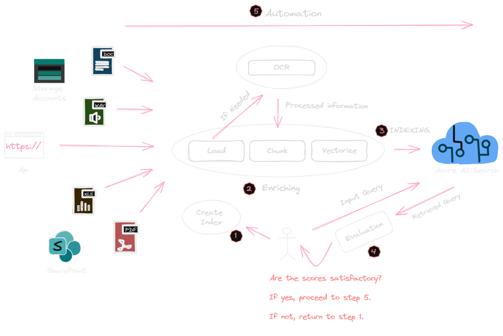
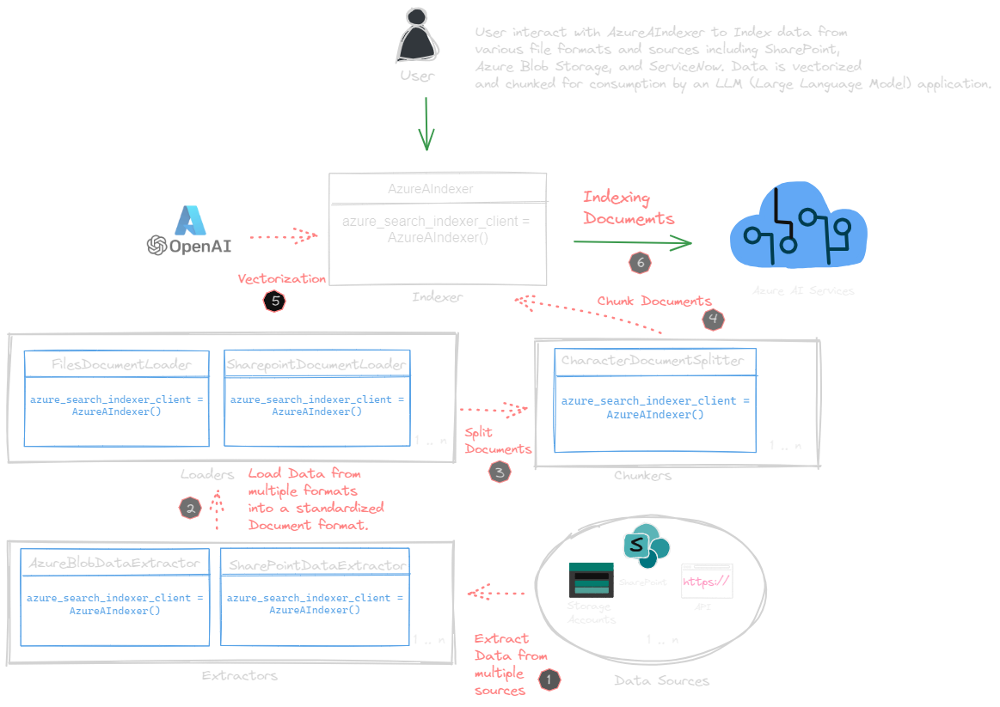

#  Azure AI Search: Vectorize and Index Your Data from Multiple Sources and Formats (Preview)

This repository offers a detailed, step-by-step guide for vectorizing, chunking, and loading data from a variety of sources and formats into Azure AI Search.

<p align="center">
    
</p>

#### 📊 Challenges with Data Chunking and Sorting:

**📏 Optimal Chunk Size**: The challenge lies in determining the right chunk size for documents. If a chunk is too large, it may surpass the model's context window, causing loss of information. Conversely, too small a chunk might lack necessary context, leading to ineffective indexing and retrieval.

**🔀 Effective Sorting Strategies**: Efficient retrieval is contingent upon how well the chunks are sorted. Prioritizing relevance in sorting is crucial but poses a challenge due to the nuanced understanding required by LLMs in discerning context and relevance within large datasets.

**🔗 Overlap Consideration**: Implementing overlapping chunks is critical for maintaining continuity and preserving context, especially in lengthy documents or complex subject matters. This requires a delicate balance to ensure that information is not fragmented or lost.

> 📌 **Note**
>
> Adjusting chunk sizes and overlaps is vital for high-quality text retrieval, especially in precision-based search applications like RAGs. Learn more about fine-tuning and relevance scores [here](https://techcommunity.microsoft.com/t5/ai-azure-ai-services-blog/azure-cognitive-search-outperforming-vector-search-with-hybrid/ba-p/3929167).

In the realm of generative AI, the search component is crucial yet often misunderstood. A grounding strategy becomes key to offering great responses to user queries. Azure AI Search offers advanced, out-of-the-box, state-of-the-art search capabilities, making it a great option for those searching for high relevance. However, achieving enhanced relevance in your Ge AI app is a dynamic process. I've simplified it into five key steps, each accompanied by a notebook filled with examples for a straightforward start. The provided code is designed to be adaptable, supporting addition of sources and formats.

## 🚀 Approach

The primary goal of this project is to facilitate a smooth integration between multiple data sources and formats and Azure AI Search Index. To achieve this, we've introduced a class named `TextChunkingIndexing`, located in the `src/gbb_ai/text_chunking_indexing.py` module. This class is designed to simplify and optimize the process of text chunking and indexing, overcoming common challenges in the process.

> ❗The `TextChunkingIndexing` class is extensible, allowing for custom logic to be added as needed. Feel free to add methods or modify existing logic to suit your specific use case.


<p align="center">
    
</p>

The streamlined vectorization process enhances the utilization of Azure AI Search's advanced out-of-the-box search capabilities (Hybrid + Rerank), thereby improving your retrieval scores during searches. Moreover, it significantly accelerates the optimization and iteration phases in your Retrieval Augmented Generation (RAG) development stage, making these highly iterative processes more efficient.

> ❗The `TextChunkingIndexing` class is extensible, allowing for custom logic to be added as needed. Feel free to add methods or modify existing logic to suit your specific use case.

### Key Features of TextChunkingIndexing

- **PDF, Docs, Web Pages, and Text Processing**: provides the ability to parse and process content from various sources including [PDFs](01-indexing_pdfs.ipynb), [web pages](02-indexing_from_web.ipynb) (including HTTPS locations), and [text](03-indexing_from_text.ipynb) or files from various applications such as SharePoint and Blob Storage.
- **Chunking and Indexing Features**: Functionality to chunk these files, which aids in organizing and structuring the data ultimately boosting relevance. Offers flexibility to tailor chunk size and overlap, aligning with diverse text processing demands.
- **Seamless Indexing into Azure Search**: efficiently index the processed and chunked files into an Azure Search index.

Also, we'll laverage the Azure AI search sdk and offering an in-depth walkthrough of the various search options available.

### 🛠 Getting Started with `TextChunkingIndexing`

This class serves as a standalone wrapper, simplifying the integration of LangChain and Azure AI Search. It streamlines the process of retrieving, storing, and indexing textual data from web and document sources into Azure AI Search.

Initialize the `TextChunkingIndexing` class:

```python
# Import the TextChunkingIndexing class from the langchain_integration module
from src.gbb_ai.langchain_integration_azureai import TextChunkingIndexing

# Create an instance of the TextChunkingIndexing class
gbb_ai_indexer = TextChunkingIndexing()

# Load the environment variables from the .env file
gbb_ai_indexer.load_environment_variables_from_env_file()
```

## 🔧 Prerequisites

Please make sure you have met all the prerequisites for this project. A detailed guide on how to set up your environment and get ready to run all the notebooks and code in this repository can be found in the [REQUIREMENTS.md](REQUIREMENTS.md) file. Please follow the instructions there to ensure a smooth exprience.

## 💼 Contributing:

Eager to make significant contributions? Our **[CONTRIBUTING](./CONTRIBUTING.md)** guide is your essential resource! It lays out a clear path.


## 🌲 Project Tree Structure

```
📂 gbbai-langchain-azureai-search
┣ 📦 src <- Houses main source code for data processing, feature engineering, modeling, inference, and evaluation. README
┣ 📂 test <- Runs unit and integration tests for code validation and QA. Check README.
┣ 📂 utils <- Contains utility functions and shared code used throughout the project. Detailed info in README
┣ 📜 .pre-commit-config.yaml <- Config for pre-commit hooks ensuring code quality and consistency.
┣ 📜  01-indexing_pdfs.ipynb <- Jupyter notebook detailing the process of indexing PDFs in Azure AI Search.
┣ 📜  02-indexing_from_web.ipynb <- Notebook for indexing content sourced from web pages in Azure AI Search.
┣ 📜  03-indexing_from_text.ipynb <- Demonstrates indexing text data from various sources in Azure AI Search.
┣ 📜  04-searching_ai_search.ipynb <- A guide to implementing and optimizing search functionalities using Azure AI Search sdk.
┣ 📜 CHANGELOG.md <- Logs project changes, updates, and version history.
┣ 📜 CONTRIBUTING.md <- Guidelines for contributing to the project.
┣ 📜 environment.yaml <- Conda environment configuration.
┣ 📜 Makefile <- Simplifies common development tasks and commands.
┣ 📜 pyproject.toml <- Configuration file for build system requirements and packaging-related metadata.
┣ 📜 README.md <- Overview, setup instructions, and usage details of the project.
┣ 📜 requirements-codequality.txt <- Requirements for code quality tools and libraries.
┣ 📜 requirements.txt <- General project dependencies.
```
